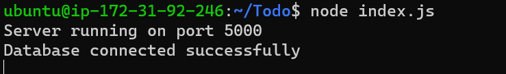

# MERN Stack on Ubuntu 20.04 

The MERN stack is an acronym for MongoDB, Express, React / Redux, and Node.js. The MERN stack is one of the most popular JavaScript stacks for building modern single-page web applications (SPA).

In this tutorial, we'll build a simple ToDo application that uses a RESTful API.

### Prerequisites
1. An Ubuntu VM (In this tutorial we're using an Ubuntu 20.04 on AWS VM Instance
   
## STEP 1 – BACKEND CONFIGURATION

Update ubuntu

`$sudo apt update`

Upgrade ubuntu

`$sudo apt upgrade`

Let’s get the location of Node.js software from Ubuntu repositories.

`$curl -fsSL https://deb.nodesource.com/setup_18.x | sudo -E bash -`

Install Node.js on the server

`$sudo apt-get install -y nodejs`

>Note: The command above installs both nodejs and npm. NPM is a package manager for Node like apt for Ubuntu, it is used to install Node modules & packages and to manage dependency conflicts.

Verify the node installation with the command below

`$node -v`

```
Output

v18.12.1
```
Verify the node installation with the command below

`$npm -v `

```
Output

8.19.2
```

### Application Code Setup

Create a new directory for your To-Do project:

`$mkdir Todo`

Run the command below to verify that the Todo directory is created with ls command

`$ls`

>You can learn more about different useful keys for ls command with ls --help.

Now change your current directory to the newly created one:

`$cd Todo`

 Initialise your project, so that a new file named **package.json** will be created. This file will normally contain information about your application and the dependencies that it needs to run.

 `$npm init`
 
  Follow the prompts after running the command. You can press **Enter** several times to accept default values, then accept to write out the package.json file by typing & **yes**.

 To confirm that you have package.json file created.

 `$ls`

`$cat package.json`

```
Output
{
  "name": "todo",
  "version": "1.0.0",
  "description": "A simple To-Do App",
  "main": "index.js",
  "scripts": {
    "test": "echo \"Error: no test specified\" && exit 1"
  },
  "author": "Phoenix",
  "license": "ISC"
}
```

### Install ExpressJS

Express is a framework for Node.js, therefore a lot of things developers would have programmed is already taken care of out of the box. Therefore, it simplifies development, and abstracts a lot of low-level details. 
>For example, Express helps to define routes of your application based on HTTP methods and URLs.

To use express, install it using npm:

`$npm install express`

Now create a file index.js with the command below

`$touch index.js`

Run `ls` to confirm that your index.js file is successfully created

```
Output
index.js  node_modules  package-lock.json  package.json
```

Install the dotenv module

`$npm install dotenv`

Open the index.js file with the command below

`$vim index.js`

Type the code below into it and save. Do not get overwhelmed by the code you see. For now, simply paste the code into the file.

```
const express = require('express');
require('dotenv').config();
 
const app = express();
 
const port = process.env.PORT || 5000;
 
app.use((req, res, next) => {
res.header("Access-Control-Allow-Origin", "\*");
res.header("Access-Control-Allow-Headers", "Origin, X-Requested-With, Content-Type, Accept");
next();
});
 
app.use((req, res, next) => {
res.send('Welcome to Express');
});
 
app.listen(port, () => {
console.log(`Server running on port ${port}`)
});

```

Notice that we have specified to use **port 5000** in the code. This will be required later when we go on the browser.
Use: **w** to save in vim and use: **qa** to exit vim

Now it is time to start our server to see if it works. Open your terminal in the same directory as your index.js file and type:

`$node index.js`

If everything goes well, you should see Server running on port 5000 in your terminal.


Now we need to open this port in EC2 Security Groups.


Open up your browser and try to access your server’s Public IP or Public DNS name followed by port 5000:

>http://PublicIP-or-PublicDNS:5000>


## Routes
There are three actions that our To-Do application needs to be able to do:
1. Create a new task
2. Display list of all tasks
3. Delete a completed task

>Each task will be associated with some particular endpoint and will use different standard **HTTP request methods**: ***POST, GET, DELETE.***

For each task, we need to create routes that will define various endpoints that the To-do app will depend on. So let us create a folder routes:

`$mkdir routes`

>Tip: You can open multiple shells in Putty or Linux/Mac to connect to the same EC2

Change directory to routes folder.

`$cd routes`

Now, create a file api.js with the command below

`$touch api.js`

Open the file with the command below

`$vim api.js`

Copy below code in the file.

```
const express = require ('express');
const router = express.Router();
 
router.get('/todos', (req, res, next) => {
 
});
 
router.post('/todos', (req, res, next) => {
 
});
 
router.delete('/todos/:id', (req, res, next) => {
 
})
 
module.exports = router;
```
Moving forward let create Models directory.

### MODELS
Now comes the interesting part, since the app is going to make use of Mongodb which is a NoSQL database, we need to create a model.
>A model is at the heart of JavaScript based applications, and it is what makes it interactive.

We will also use models to define the **database schema**.
This is important so that we will be able to define the fields stored in each Mongodb document. 

>To create a Schema and a model, install mongoose which is a Node.js package that makes working with mongodb easier.

Change directory back Todo folder with **cd ..** and install Mongoose

`$npm install mongoose`

Create a new folder models :

`$mkdir models`

Change directory into the newly created ‘models’ folder with

`$cd models`

Inside the models folder, create a file 

`$touch todo.js`

>Tip: All three commands above can be defined in one line to be executed consequently with help of && operator, like this:
`mkdir models && cd models && touch todo.js`

Open the file created with vim todo.js then paste the code below in the file:

```
const mongoose = require('mongoose');
const Schema = mongoose.Schema;
 
//create schema for todo
const TodoSchema = new Schema({
action: {
type: String,
required: [true, 'The todo text field is required']
}
})
 
//create model for todo
const Todo = mongoose.model('todo', TodoSchema);
 
module.exports = Todo;
```
Now we need to update our routes from the file **api.js** in **‘routes’** directory to make use of the new model.
In Routes directory, open **api.js** with 

`$vim api.js`

>delete the code inside with ***:%d*** command and paste there code below into it then save and exit

```
const express = require ('express');
const router = express.Router();
const Todo = require('../models/todo');
 
router.get('/todos', (req, res, next) => {
 
//this will return all the data, exposing only the id and action field to the client
Todo.find({}, 'action')
.then(data => res.json(data))
.catch(next)
});
 
router.post('/todos', (req, res, next) => {
if(req.body.action){
Todo.create(req.body)
.then(data => res.json(data))
.catch(next)
}else {
res.json({
error: "The input field is empty"
})
}
});
 
router.delete('/todos/:id', (req, res, next) => {
Todo.findOneAndDelete({"_id": req.params.id})
.then(data => res.json(data))
.catch(next)
})
 
module.exports = router;
```

The next piece of our application will be the MongoDB Database

## MongoDB Database
 At this point we need DB to be hosted somewhere, which is where **mLab** comes into the picture.
mLab provides MongoDB database as a service solution (DBaaS).You will need to sign up for a shared clusters free account, which is ideal for our use case.

- Sign up <https://www.mongodb.com/atlas-signup-from-mlab>
- Follow the sign up process, - Select AWS as the cloud provider, and choose a region near you.

There are a few things you must do to allow you connect to your hosted DB on mLab.
First on the Network access tab you must allow access to the MongoDB database from anywhere 
*image Mongo network access


>IMPORTANT NOTE In the image below, make sure you change the time of deleting the entry from 6 Hours to 1 Week

Next is to create a MongoDB database and collection inside mLab


Additionally, add the connection string to access the database you just created from inside your app, just as below:

>`DB = 'mongodb+srv://<username>:<password>@<network-address>/<dbname>?retryWrites=true&w=majority'`

Ensure to update, and according to your setup


Now we need to update the **index.js** to reflect the use of **.env** so that Node.js can connect to the database.
Simply delete existing content in the file, and update it with the entire code below.

```
const express = require('express');
const bodyParser = require('body-parser');
const mongoose = require('mongoose');
const routes = require('./routes/api');
const path = require('path');
require('dotenv').config();
 
const app = express();
 
const port = process.env.PORT || 5000;
 
//connect to the database
mongoose.connect(process.env.DB, { useNewUrlParser: true, useUnifiedTopology: true })
.then(() => console.log(`Database connected successfully`))
.catch(err => console.log(err));
 
//since mongoose promise is depreciated, we overide it with node's promise
mongoose.Promise = global.Promise;
 
app.use((req, res, next) => {
res.header("Access-Control-Allow-Origin", "\*");
res.header("Access-Control-Allow-Headers", "Origin, X-Requested-With, Content-Type, Accept");
next();
});
 
app.use(bodyParser.json());
 
app.use('/api', routes);
 
app.use((err, req, res, next) => {
console.log(err);
next();
});
 
app.listen(port, () => {
console.log(`Server running on port ${port}`)
});

```
Start your server using the command:

`$node index.js`

You should see this



## Testing Backend Code without Frontend using RESTful API
Even we've written the backend part of our To-Do application, and configured a database, we're left with the frontend, which we'll create with ReactJS. However, usually during development, we will need a way to test our code using RESTfulL API. Therefore, we will need to make use of some API development client to test our code.

In this project, we will use Postman to test our API. Click Install Postman <https://www.getpostman.com/> to download and install postman on your machine (I'll be using the browser-enabled version of Postman).

You should test all the API endpoints and make sure they are working. For the endpoints that require body, we'd send JSON back with the necessary fields since it’s what we setup in our code.

Now open your Postman, create a POST request to the API http://<PublicIP-or-PublicDNS>:5000/api/todos. 
This request sends a new task to our To-Do list so the application could store it in the database.

>Note: make sure your set header key Content-Type as application/json


create a GET request to your API on http://<PublicIP-or-PublicDNS>:5000/api/todos. This request retrieves all existing records from out Todoly app.


Also try the same for the DELETE request to delete a task from out To-Do list.
Hint: You don't need to put a body parameter, you just  you need to send its ID as a part of DELETE request.
http://<PublicIP-or-PublicDNS>:5000/api/todos/:id


## STEP 2 Frontend creation
It's time to create a UI to interact with the ToDO app via API. To start out with the frontend of the To-do app, we will use the ***create-react-app*** command to scaffold our app.

In a terminal, which is the same root directory as your backend code, which is the *Todo* directory, run:

`$ npx create-react-app client`

This will create a new folder in your Todo directory called *client*, where you will add all the react code.

### Running a React App
Before testing the react app, there are some dependencies that need to be installed.

**Install concurrently**. It is used to run more than one command simultaneously from the same terminal window.

`$npm install concurrently --save-dev`

**Install nodemon**. It is used to run and monitor the server. If there is any change in the server code, nodemon will restart it automatically and load the new changes.

`$npm install nodemon --save-dev`

In Todo folder open the package.json file. Change the highlighted part of the below screenshot and replace with the code below.
```
"scripts": {
"start": "node index.js",
"start-watch": "nodemon index.js",
"dev": "concurrently \"npm run start-watch\" \"cd client && npm start\""
},
```


It should look like this after editing it:


Also, configure Proxy in package.json. Change directory to ***client***. Open the package.json file and add the key value pair in the package.json file

`"proxy": "http://localhost:5000"`

The whole purpose of adding the proxy configuration is to make it possible to access the application directly from the browser by simply calling the server url like <http://localhost:5000> rather than always including the entire path like <http://localhost:5000/api/todos>

Now, ensure you are inside the Todo directory, and simply do:

`npm run dev`

Your app should open and start running on localhost:3000


> Important note: In order to be able to access the application from the Internet you have to open TCP port 3000 on EC2 by adding a new Firewall rule.


### Creating your React Components

One of the advantages of react is that it makes use of components, which are reusable and also makes code modular. 
>For our Todo app, there will be two stateful components and one stateless component.

From your Todo directory run

`$cd client`

move to the src directory

`$cd src`

Inside your **src folder** create another folder called components

`$mkdir components`

`$cd components`

Inside **‘components’** directory create three files Input.js, ListTodo.js and Todo.js.

`$touch Input.js ListTodo.js Todo.js`

Your file structure should look like this:


Open Input.js file

`$vi Input.js`

Copy and paste the following
```
import React, { Component } from 'react';
import axios from 'axios';
 
class Input extends Component {
 
state = {
action: ""
}
 
addTodo = () => {
const task = {action: this.state.action}
 
    if(task.action && task.action.length > 0){
      axios.post('/api/todos', task)
        .then(res => {
          if(res.data){
            this.props.getTodos();
            this.setState({action: ""})
          }
        })
        .catch(err => console.log(err))
    }else {
      console.log('input field required')
    }
 
}
 
handleChange = (e) => {
this.setState({
action: e.target.value
})
}
 
render() {
let { action } = this.state;
return (
<div>
<input type="text" onChange={this.handleChange} value={action} />
<button onClick={this.addTodo}>add todo</button>
</div>
)
}
}
 
export default Input
```
To make use of **Axios**, which is a Promise based HTTP client for the browser and node.js, you need to `cd client` from your terminal and run

`$npm install axios`

Almost done!
:boom::star2::sparkles:

Go to *‘components’* directory

`$cd src/components`

After that open your ListTodo.js

`$vi ListTodo.js`

in the ListTodo.js copy and paste the following code
```
import React from 'react';
 
const ListTodo = ({ todos, deleteTodo }) => {
 
return (
<ul>
{
todos &&
todos.length > 0 ?
(
todos.map(todo => {
return (
<li key={todo._id} onClick={() => deleteTodo(todo._id)}>{todo.action}</li>
)
})
)
:
(
<li>No todo(s) left</li>
)
}
</ul>
)
}
 
export default ListTodo
Then in your Todo.js file you write the following code
import React, {Component} from 'react';
import axios from 'axios';
 
import Input from './Input';
import ListTodo from './ListTodo';
 
class Todo extends Component {
 
state = {
todos: []
}
 
componentDidMount(){
this.getTodos();
}
 
getTodos = () => {
axios.get('/api/todos')
.then(res => {
if(res.data){
this.setState({
todos: res.data
})
}
})
.catch(err => console.log(err))
}
 
deleteTodo = (id) => {
 
    axios.delete(`/api/todos/${id}`)
      .then(res => {
        if(res.data){
          this.getTodos()
        }
      })
      .catch(err => console.log(err))
 
}
 
render() {
let { todos } = this.state;
 
    return(
      <div>
        <h1>My Todo(s)</h1>
        <Input getTodos={this.getTodos}/>
        <ListTodo todos={todos} deleteTodo={this.deleteTodo}/>
      </div>
    )
 
}
}
 
export default Todo;
```
We need to make little adjustment to our react code. Delete the logo and adjust our App.js to look like this.

Move to the src folder

`$cd ..`

Make sure that you are in the src folder and run

`vi App.js`

Copy and paste the code below into it
```
import React from 'react';
 
import Todo from './components/Todo';
import './App.css';
 
const App = () => {
return (
<div className="App">
<Todo />
</div>
);
}
 
export default App;
```
After pasting, exit the editor.
In the src directory open the App.css

`$vi App.css`

Then paste the following code into App.css:
```
.App {
text-align: center;
font-size: calc(10px + 2vmin);
width: 60%;
margin-left: auto;
margin-right: auto;
}
 
input {
height: 40px;
width: 50%;
border: none;
border-bottom: 2px #101113 solid;
background: none;
font-size: 1.5rem;
color: #787a80;
}
 
input:focus {
outline: none;
}
 
button {
width: 25%;
height: 45px;
border: none;
margin-left: 10px;
font-size: 25px;
background: #101113;
border-radius: 5px;
color: #787a80;
cursor: pointer;
}
 
button:focus {
outline: none;
}
 
ul {
list-style: none;
text-align: left;
padding: 15px;
background: #171a1f;
border-radius: 5px;
}
 
li {
padding: 15px;
font-size: 1.5rem;
margin-bottom: 15px;
background: #282c34;
border-radius: 5px;
overflow-wrap: break-word;
cursor: pointer;
}
 
@media only screen and (min-width: 300px) {
.App {
width: 80%;
}
 
input {
width: 100%
}
 
button {
width: 100%;
margin-top: 15px;
margin-left: 0;
}
}
 
@media only screen and (min-width: 640px) {
.App {
width: 60%;
}
 
input {
width: 50%;
}
 
button {
width: 30%;
margin-left: 10px;
margin-top: 0;
}
}
```
Go to the Todo directory

`$cd ../..`

When you are in the Todo directory run:

`$npm run dev`


Assuming no errors when saving all these files, our To-Do app should be ready and fully functional with the functionality discussed earlier: creating a task, deleting a task and viewing all your tasks.

Now lets head to the browser

<http://ip-address:5000>

You should see something like this!


 ***You wrote a frontend application using React.js that communicates with a backend application written using Expressjs. You also created a MongoDB backend for storing tasks in a database.***

**CONGRATULATIONS** :tada::confetti_ball::balloon::fireworks::sparkler: